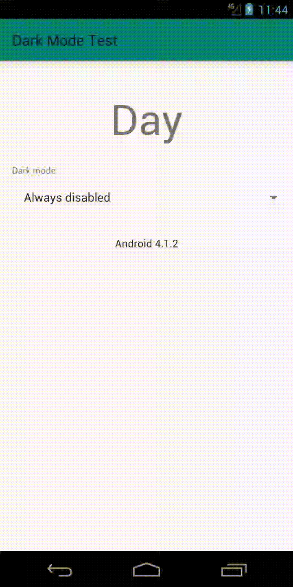
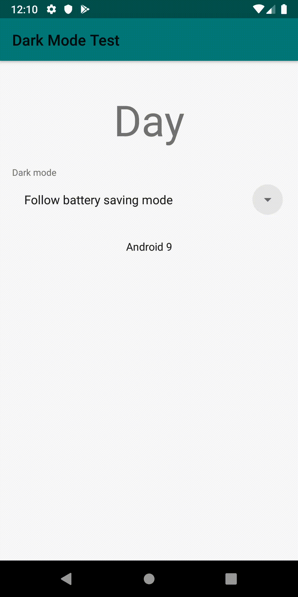
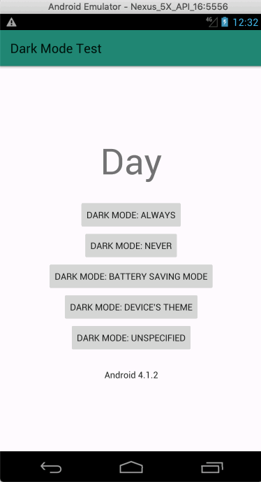

# Android with Dark Mode

Using the [DayNight API](https://developer.android.com/preview/features/darktheme) from Android 10 in a Android Jelly Bean

  



As described in the documentation, only the options `Dark Mode: Always` e `DarkMode: Never` have effect in the old APIs.

```
Dark Mode: Always -> MODE_NIGHT_YES
Dark Mode: Never -> MODE_NIGHT_NO
Dark Mode: Battery Saving Mode -> MODE_NIGHT_AUTO_BATTERY // Available in devices with "Battery Saving Mode" option
Dark Mode: Device's Theme -> MODE_NIGHT_FOLLOW_SYSTEM // Available only in Android 10 throught "Dark Theme" and Android Pie from "Night Mode" option in "Developer options"
Dark Mode: Unspecified -> MODE_NIGHT_UNSPECIFIED
```
